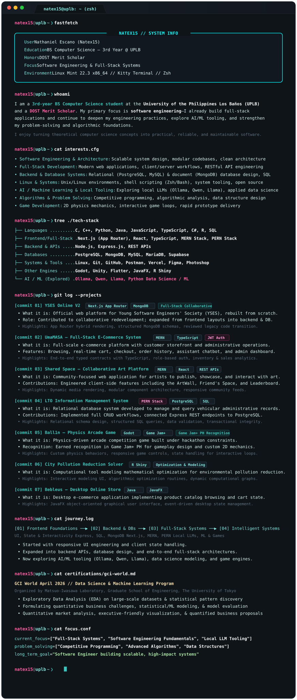

<!-- Master Terminal SVG Window -->

 

<!-- Interactive CLI Endpoints -->

---

<b>[+] Expand Accessible Text &amp; Project Documentation (for Search &amp; Screen Readers)</b>

 

### Profile Overview
- **Name:** Nathaniel Escano (Natex15)
- **Status:** 3rd-year BS Computer Science student at the University of the Philippines Los Baños (UPLB)
- **Honors:** DOST Merit Scholar
- **Primary Focus:** Software Engineering & Full-Stack Systems
- **Environment:** Linux Mint 22.3 x86_64, Kitty Terminal, Zsh

### About Me
I am a 3rd-year BS Computer Science student at UPLB and a DOST Merit Scholar with a primary focus in software engineering. I already build full-stack applications and continue to deepen my engineering practices, explore AI/ML tooling, and strengthen my problem-solving and algorithmic foundations.

### Technical Interests
- **Software Engineering & Architecture:** Scalable system design, modular codebases, and clean architecture
- **Full-Stack Development:** Modern web applications, client/server workflows, and RESTful API engineering
- **Backend & Database Systems:** Relational (PostgreSQL, MySQL) and document (MongoDB) database design, SQL querying
- **Linux & Systems:** Unix/Linux environments, shell scripting (Zsh/Bash), system tooling, and open-source software
- **AI / Machine Learning & Local Tooling:** Exploring local LLMs (Ollama, Qwen, Llama) and applied data science
- **Algorithms & Problem Solving:** Competitive programming, algorithmic analysis, and data structure design
- **Game Development:** 2D physics mechanics, interactive game loops, and rapid prototype delivery

### Technologies & Stack
- **Languages:** C, C++, Python, Java, JavaScript, TypeScript, C#, R, SQL
- **Frontend & Full-Stack:** Next.js (App Router), React, TypeScript, MERN Stack, PERN Stack
- **Backend & APIs:** Node.js, Express.js, REST APIs
- **Databases:** PostgreSQL, MongoDB, MySQL, MariaDB, Supabase
- **Systems & Tools:** Linux, Git, GitHub, Postman, Vercel, Figma, Photoshop
- **Other Engines:** Godot, Unity, Flutter, JavaFX, R Shiny
- **AI / ML Tooling (Explored):** Ollama, Qwen, Llama, Python Data Science / Machine Learning stack

### Featured Projects
1. **YSES Online V2:** Official web platform for the Young Software Engineers' Society (YSES), rebuilt from scratch using Next.js App Router and MongoDB while expanding from frontend layouts into backend engineering and database integration.
2. **UmaMASA:** Comprehensive full-stack e-commerce system built on the MERN stack with TypeScript, featuring customer storefront, real-time cart, checkout, order history, assistant chatbot, and an admin management dashboard (inventory, user administration, analytics, sales reporting).
3. **Shared Space:** Collaborative art-sharing community platform built on MERN; engineered key client-side interactive modules including the ArtWall, Friend's Space, and Leaderboard.
4. **LTO Information Management System:** Relational database management system built with the PERN stack (PostgreSQL, Express, React, Node.js), implementing complete administrative CRUD operations and SQL schema querying.
5. **Ball1n:** Physics-driven arcade competition game built in Godot for the global Game Jam+ hackathon; recognized in Game Jam+ PH.
6. **City Pollution Reduction Solver:** Interactive computational modeling and optimization application developed in R Shiny to calculate environmental pollution reduction strategies.
7. **Bebleus:** Desktop e-commerce application developed in Java featuring catalog browsing, shopping cart operations, and local state management with a JavaFX graphical interface.

### Development Journey
- **Frontend Foundations:** Mastered responsive user interfaces, modular components, and client-side state handling.
- **Backend & Database Expansion:** Broadened scope into server-side architectures, RESTful API design, and database modeling with relational (PostgreSQL) and document (MongoDB) databases.
- **Full-Stack Systems:** Building end-to-end full-stack software across modern stacks (Next.js App Router, MERN, PERN), contributing to collaborative team codebases and developing architectural solutions from scratch.
- **Exploration & Intelligent Systems:** Exploring AI/ML tooling, local LLM workflows (Ollama, Qwen, Llama), data science modeling, algorithmic problem solving, and game development.

### Data Science & Machine Learning Program
- **GCI World April 2026** (Matsuo-Iwasawa Laboratory, Graduate School of Engineering, The University of Tokyo): Completed data science program covering Exploratory Data Analysis (EDA) on large-scale datasets, statistical/ML modeling, quantitative market analysis, executive-friendly visualization, and quantified business proposals.

### Current Focus & Direction
- **Current Focus:** Full-Stack Systems, Software Engineering Fundamentals, Local LLM Tooling, and Competitive Programming.
- **Long-Term Goal:** Software Engineer building scalable, high-impact systems.

*Always open to learning, collaborative engineering, and building meaningful software.*

